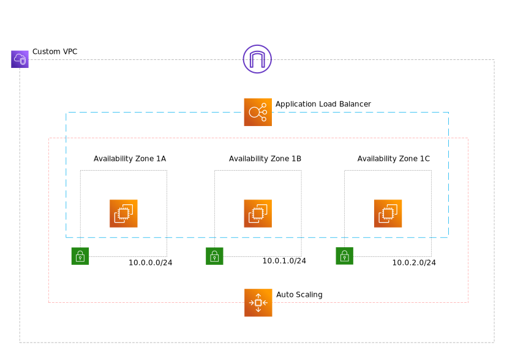

# Create a scalable AWS infrastructure using Terraform

This module will build the following infrastructure: 

* custom VPC
* a new subnet in each Availability Zone
* an Internet Gateway,
* an Application Load Balancer,
* an Auto Scaling group and a launch configuration.

## Usage

You should have IAM user AWS credentials saved on the host. Terraform supports the same authentication mechanisms as all AWS CLI and SDK tools so feel free to provide it the way you prefer.

To run this example you have to enable remote state storage with S3. 

* Open `s3/main.tf`,
* disable the terraform config starting at line 51,
* set a unique bucket name (lines 15 and 58),
* save the file
  
Run `terraform init` to download the providers for this module and then run `terraform apply` to deploy your code.

 Note that S3 bucket names must be *globally* unique.

 When the bucket and the table is created, open the `s3/main.tf` file again, enable the terraform config block (starting at line 51), call `terraform init` again and `terraform apply` to store the state file in the S3 bucket.
 
 Go to the envs\stage-eu-west-2 directory and start building individual modules. You can use Terragrunt to automate it and build the whole infrastructure with one command.